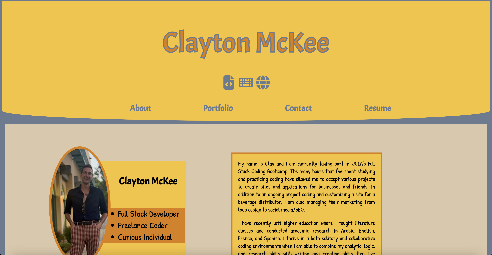

# revitalized-professional-portfolio

## Description

This new, revitalized professional portfolio shows the progress that I've made as a coder. Rather than using standard HTML and CSS, this project uses React to build an interactive site. All styling is done using flexbox and CSS (rather than a framework). The contact form uses Form Spree for its functionality. Icons are from Font Awesome and fonts are from Google Fonts. 

## Screenshots

## Live Site

https://cmckee120993.github.io/revitalized-professional-portfolio/#resume

## Questions 

 If you have any questions, email me at cmckee120993@gmail.com. 

 You can view more of my work at [cmckee120993](https://github.com/cmckee120993).